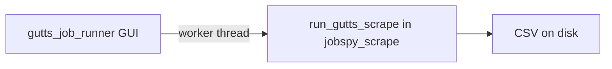

# GUTTS job scraper runner (GUI + .exe)

> Working copy of the implementation plan for this repo. Update checkboxes/todos here as you go.

## Goal

Your boss opens an application, picks options (location, radius, sites, job age, etc.), clicks **Run**, and gets a CSV in a chosen folder—without using the terminal. Delivery target: **standalone `.exe`** (no Python install on their machine).

## Architecture

- **GUI thread**: forms, validation, disable Run while busy, append log text.
- **Worker thread**: calls the scrape pipeline so the window does not freeze (never call `scrape_jobs` directly on the Tk main thread).

## 1. Refactor [`jobspy_scrape.py`](./jobspy_scrape.py)

Extract the logic currently inside `main()` into a single callable, e.g. **`run_gutts_scrape(config) -> tuple[Path, int]`** returning `(output_path, row_count)`:

- Introduce a small **`ScrapeConfig`** (`dataclass`) holding: `search_term`, `second_pass_search`, `location`, `distance`, `sites`, `results_wanted`, `multi_query`, `hours_old`, `country_indeed`, `google_search_term` (optional), `output` (optional), `output_dir`, `linkedin_fetch_description`, `verbose`.
- Move the pass loop, concat, `dedupe_by_job_url`, `sort_by_recency`, `scraped_at` column, and `to_csv` into this function.
- Keep **`parse_args()` + `main()`** as a thin CLI wrapper that builds `ScrapeConfig` from argparse and calls `run_gutts_scrape` (so your existing command-line usage stays the same).

This avoids duplicating behavior between CLI and GUI.

## 2. New GUI: [`gutts_job_runner.py`](./gutts_job_runner.py)

Use **`tkinter`** only (stdlib on Windows with Python—no extra GUI dependency). The UI should make **every adjustable parameter** obvious, with short help text where JobSpy behavior differs from plain English.

### Job title vs description (important for the plan)

- JobSpy’s main field is **`search_term`**: on **Indeed** (and similarly on several boards), that string is matched against **both job title and job description**, not “title only” or “description only” separately. There is **no separate API knob** in JobSpy for “title only” vs “description only” for those sites.
- The GUI should label the primary box something like: **“Search keywords (matches job title and job posting text on most boards)”** so your boss does not expect a literal “title-only” filter unless we document otherwise.
- **Google** is different: optional **`google_search_term`** can override how Google Jobs is queried (best when pasted from a real Google Jobs search). When Google is checked, show an optional **“Google Jobs search (optional override)”** field with one-line help: “Leave blank to build from keywords + location above.”
- **LinkedIn** has **`linkedin_fetch_description`**: this does **not** change *search*; it fetches **full description text** for each result (slower). Label: **“LinkedIn: load full job descriptions (slower)”**.

### Full list of parameters the boss can change (maps to `ScrapeConfig` / `scrape_jobs`)

| User-facing concept | Underlying field(s) | Notes |
|--------------------|---------------------|--------|
| **Keywords / what to look for** | `search_term` | Main query; multiline OK; Indeed-style `OR` / quotes supported per JobSpy docs. |
| **Second search (optional)** | `second_pass_search` + `multi_query` | Only used when “Run a second search pass” is enabled; merges + dedupes with first pass. |
| **Search center** | `location` | e.g. city, state or “Washington, DC”. |
| **Search radius** | `distance` | Miles from center. |
| **How far back to look** | `hours_old` | Expose as **days** (or days + hours) in UI; convert to hours internally. |
| **How many results per site** | `results_wanted` | Cap per board per run; help text if rate limits. |
| **Which job sites** | `sites` | Checkboxes → list `indeed`, `zip_recruiter`, `linkedin`, `glassdoor`, `google`. |
| **Country (Indeed / Glassdoor)** | `country_indeed` | Default USA; dropdown or text. |
| **Google Jobs wording (optional)** | `google_search_term` | Optional; only relevant when Google is selected. |
| **Where to save CSV** | `output_dir`, `output` | Folder picker + optional fixed filename vs auto timestamp. |
| **LinkedIn extra fetch** | `linkedin_fetch_description` | Boolean. |
| **Log detail** | `verbose` | 0 / 1 / 2. |

Optional **presets** (nice-to-have in implementation): dropdown **“Preset: GUTTS trades (default)”** that fills keyword boxes from constants; **“Custom”** leaves fields editable.

### Screen layout (grouped for clarity)

Use tabs or stacked **LabelFrames** so it reads top-to-bottom like a form:

1. **Job & keywords** — Primary keywords (multiline), checkbox **Second search pass**, second multiline (enabled when checked), short inline help on title+description behavior.
2. **Where** — Search center, radius (miles), country for Indeed/Glassdoor.
3. **How many & how fresh** — Results per site, max job age (days).
4. **Boards** — Checkboxes for each site (Indeed, ZipRecruiter, LinkedIn, Glassdoor, Google).
5. **Google (if enabled)** — Optional Google Jobs override string (can live under **Advanced** if Google unchecked by default).
6. **Output** — Output folder (Browse), optional custom filename (empty = timestamped).
7. **Advanced** — Verbose, LinkedIn full descriptions, (optional) second-pass text if not shown above.

| Section | Controls |
|--------|----------|
| Job & keywords | Multiline **Primary keywords** (default from `GUTTS_DEFAULT_SEARCH`), checkbox **Use second search pass**, multiline **Second pass keywords** (`GUTTS_SECOND_PASS_SEARCH` default), help text for title+description matching. |
| Where | **Search center** (`location`), **Radius (miles)** (`distance`), **Country** (`country_indeed`). |
| How many / fresh | **Results per site** (`results_wanted`), **Only show jobs from the last N days** (`hours_old` via conversion). |
| Boards | Checkboxes → `sites` list. |
| Output | **Output folder** + **Browse**, optional **File name** (blank = `gutts_jobs_YYYY-MM-DD_HHMMSS.csv`). |
| Advanced | **Google Jobs search override** (optional), **Verbose**, **LinkedIn: fetch full descriptions**. |
| Actions | **Run**, **Log** (`ScrolledText`), **Open folder** on success. |

**Threading**: On Run, validate at least one site checked; build `ScrapeConfig`; start `threading.Thread` targeting `run_gutts_scrape`; use `queue.Queue` or `tk.after` to post log lines and final success/error `messagebox`.

**Errors**: Catch exceptions in the worker; show traceback tail in the log + error dialog (boss can screenshot for you).

## 3. Dependencies: [`requirements.txt`](./requirements.txt)

Pin what you use in production, e.g. `python-jobspy` (and let pip resolve pandas/numpy). Add **`pyinstaller`** as a separate optional line or document it only in the build script (see below).

## 4. PyInstaller build (Windows `.exe`)

Add a small **`build_exe.bat`** in the project root that developers run once to produce `dist\GUTTSJobRunner.exe`:

- Use **`--onefile --windowed`** (no console flash for the GUI).
- Typical needs for JobSpy/pandas stacks: **`--collect-all jobspy`** (or explicit `--hidden-import` entries if the build warns), and often **`--collect-all pandas`** / numpy as needed after a test build.
- Set entry point to **`gutts_job_runner.py`**.

**Reality check**: First build may require 1–2 iteration passes to fix missing hidden imports; that’s normal for PyInstaller + scientific stacks.

**Distribution**: Zip the `.exe` (and a short **how-to.txt** if you want zero markdown files). Warn that Windows SmartScreen may flag unsigned exes until code-signed.

## 5. What you send your boss

- **`GUTTSJobRunner.exe`** (from `dist/`) plus one line: “Save CSVs to a folder you can find; first run may take a few minutes.”
- You keep **`jobspy_scrape.py`** for CLI/automation; the boss only needs the `.exe` if the build succeeds.

## Out of scope (unless you ask later)

- Code signing the `.exe`
- Auto-update / installer (NSIS/Inno Setup)
- macOS build (different PyInstaller story)
